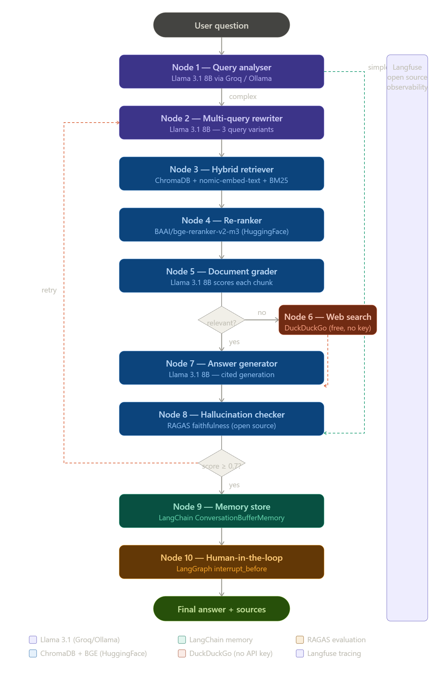

# TrustRAG

TrustRAG is a planned agentic RAG system focused on source-grounded answers, hybrid retrieval, reranking, hallucination checks, and human-in-the-loop review. The target stack uses Ollama for local LLM and embedding models.



## Status

Current status: ingestion, parent-child chunking, BM25 retrieval, and vector
retrieval foundations are in place. Core RAG implementation is in progress.

## Local Configuration

TrustRAG reads Ollama embedding settings from `.env`:

```env
TRUSTRAG_OLLAMA_BASE_URL=https://ollama.alvision.in
TRUSTRAG_EMBEDDING_MODEL=embeddinggemma:latest
```

Use [.env.example](D:/Development/TrustRAG/.env.example) as the template. The
real `.env` file is ignored by Git.

Generated ingestion outputs and local Chroma indexes are intentionally ignored by
Git.

## Target Features

- Document ingestion and chunking
- Local LLM and embeddings through Ollama
- Hybrid retrieval with ChromaDB and BM25
- Reranking with a cross-encoder model
- Source-cited answer generation
- Hallucination checking
- Web fallback for missing context
- LangGraph-based agent workflow
- Langfuse observability
